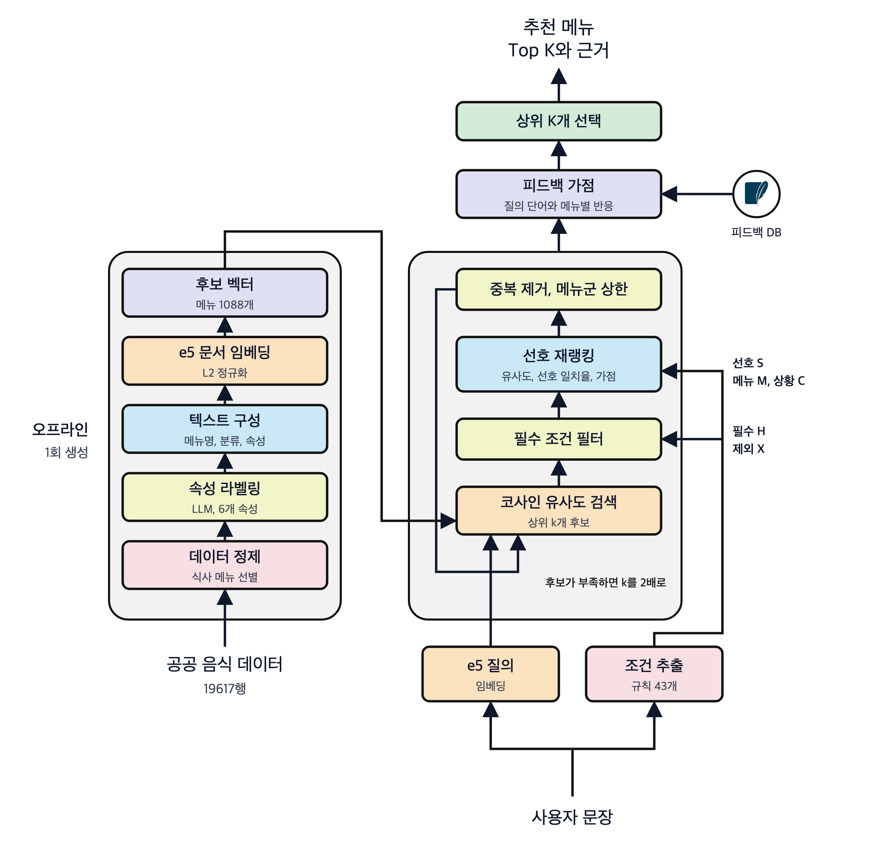

# 먹지 AI 추천 서버

자유롭게 쓴 한국어 문장을 받아 조건을 해석하고 음식 메뉴 상위 K개를 추천하는 AI 모듈과 API 서버

예를 들어 비도 오고 쌀쌀한데 얼큰한 국물 먹고 싶어 라고 입력하면 매운맛, 국물, 온도 조건을 뽑고 비 오는 날에 어울리는 메뉴를 함께 고려해 추천한다

## 기술 구성

| 구분 | 내용 |
|---|---|
| 언어 | Python 3 |
| API 서버 | FastAPI, Uvicorn |
| 임베딩 모델 | multilingual e5 base |
| 학습과 추론 | PyTorch CPU, sentence transformers |
| 데이터 처리 | pandas, numpy, scikit learn |
| 피드백 저장 | SQLite |
| 테스트 | pytest |
| 배포 | Docker, Docker Compose, GitHub Actions |

## 추천 파이프라인



- 문장에서 필수 조건, 선호 조건, 언급한 메뉴, 제외한 메뉴, 상황을 뽑는다
- 문장을 임베딩해 후보 메뉴와의 코사인 유사도로 상위 100개를 찾는다
- 필수 조건을 어기거나 제외한 메뉴에 해당하는 후보를 걸러 낸다
- 유사도, 선호 조건 일치율, 메뉴 가점을 합친 점수로 다시 정렬한다
- 같은 메뉴의 변형을 지우고 같은 메뉴군이 결과를 독차지하지 않게 제한한다
- 후보가 부족하면 검색 범위를 넓혀 다시 시도한다
- 사용자 피드백 가점을 더해 최종 메뉴 목록과 추천 근거를 돌려준다

## 모듈 구성

| 모듈 | 역할 |
|---|---|
| preprocessing | 음식 데이터 정제, 음식 계열 추정, 사용자 문장 조건 추출 규칙 |
| labeling | LLM 기반 음식 속성 라벨링, 스키마 검증, 재라벨링 |
| embedding | 메뉴 텍스트 구성, 문장과 메뉴 임베딩, 결과 저장과 재사용 판정 |
| retrieval | 저장된 임베딩 호환 확인, 코사인 유사도 후보 검색 |
| ranking | 필수 조건 필터, 선호 점수 재랭킹, 중복과 다양성 제어 |
| recommendation | 전체 파이프라인 조합, 상위 K개 추천, 평가 지표 |
| api | 추천 API 서버, 피드백 저장, 미세조정 |

## 데이터

공공데이터포털의 식품 영양성분 데이터를 식사 메뉴 단위로 정제해 추천 후보를 만든다

| 단계 | 건수 | 처리 |
|---|---:|---|
| 원본 | 19617 | 식품 영양성분 DB |
| 정제 | 18998 | 이름 정리, 중량 분리, 컬럼 선별 |
| 식사 메뉴 | 8032 | 반찬, 디저트, 음료 제외 |
| 라벨링 단위 | 5219 | 같은 메뉴의 중복 행 통합 |
| 공공 데이터 | 1123 | 업체명이 있는 프랜차이즈 메뉴 제외 |
| 추천 후보 | 1088 | 쌀밥, 잡곡밥 같은 맨밥 제외 |

프랜차이즈를 제외한 이유는 같은 메뉴의 브랜드별 변형이 상위를 독점하는 문제를 막고 데이터 출처를 일관되게 유지하기 위해서다

### 속성 라벨

| 속성 | 값 |
|---|---|
| 매운맛 | 없음, 약함, 보통, 강함 |
| 국물 | 국물요리, 국물약간, 국물없음 |
| 제공온도 | 뜨거움, 따뜻함, 상온, 차가움 |
| 조리법 | 끓임, 볶음, 구이, 튀김, 찜, 조림, 부침, 오븐, 비조리, 혼합 |
| 기름짐 | 낮음, 보통, 높음 |
| 든든함 | 가벼움, 보통, 든든함 |

- 메뉴 이름 정보만 입력으로 LLM이 라벨을 매기고, 스키마 밖의 값이나 형식 오류는 검증 단계에서 걸러 다시 매긴다
- 라벨을 정할 수 없는 경우는 미확인으로 두며 미확인은 필수 조건을 충족하지 않는 것으로 본다
- 한식, 중식, 일식, 양식, 동남아, 분식 계열과 안주 여부는 메뉴명 키워드 규칙으로 추정하고 LLM 라벨이 있으면 그 값을 우선한다

## 핵심 로직

### 조건 추출

정규식 규칙 43개로 문장을 다섯 요소로 나눈다

```math
\pi(q) = (H, S, M, X, C)
```

| 기호 | 의미 | 예시 |
|---|---|---|
| $H$ | 필수 조건 | 맵지 않은, 국물 없는, 튀김 말고 |
| $S$ | 선호 조건 | 얼큰한, 따뜻한, 가볍게 |
| $M$ | 언급한 메뉴 | 샌드위치, 국밥 |
| $X$ | 제외한 메뉴 | 피자 말고의 피자 |
| $C$ | 상황이 연상한 메뉴 | 비 오는 날의 칼국수, 전 |

- 규칙은 우선순위 순서로 적용하고 앞서 매칭된 구간과 겹치는 매칭은 버린다
- 선호 표현 바로 뒤에 싫, 빼, 말고, 못 먹, 아닌, 별로 같은 거부어가 오면 극성을 뒤집어 여집합을 필수 조건으로 만든다

```math
(a, A) \in S \ \text{and followed by rejection} \ \Rightarrow \ (a,\ V_a \setminus A) \in H
```

- 예를 들어 매운 건 싫어 는 매운맛 없음 또는 약함 이라는 필수 조건이 된다
- 꼭, 반드시, 무조건 이 앞에 붙으면 선호 조건을 같은 허용값의 필수 조건으로 올린다
- 같은 속성의 필수 조건은 교집합으로 합치고, 교집합이 비면 모순으로 보고 결과 대신 사유를 돌려준다

```math
A^H_a = \bigcap_{i=1}^{m} A^{(i)}_a, \qquad A^H_a = \varnothing \Rightarrow \text{contradiction}
```

- 이중 부정이나 단짠, 상큼처럼 스키마 밖의 맛 표현은 조건 없이 기록만 한다

### 임베딩 검색

질의와 메뉴 텍스트를 같은 인코더로 임베딩하고 L2 정규화한 뒤 내적으로 유사도를 구한다

```math
s(q, d) = \left\langle f(\text{query}\ q),\ f(\text{passage}\ \text{text}(d)) \right\rangle, \qquad \lVert f(\cdot) \rVert_2 = 1
```

- 메뉴 텍스트는 메뉴명, 대표식품명, 식품대분류명 뒤에 미확인이 아닌 속성 값을 붙여 만든다
- 속성 값을 붙인 텍스트가 이름만 쓴 텍스트보다 nDCG와 MRR 모두 높아 이를 기본으로 쓴다
- 저장된 임베딩은 모델 리비전, 접두어, 풀링 방식, 원본 파일 해시를 기록한 매니페스트와 대조해 일치할 때만 불러온다

### 필터

```math
\mathcal{F}_k(q) = \left\lbrace  d \in \mathcal{C}_k(q) \ :\ \forall (a, A) \in H,\ \ell_a(d) \in A \ \land\ \forall t \in X,\ \mu(d, t) = 0 \right \rbrace
```

- $\mathcal{C}_k(q)$ 는 유사도 상위 $k$ 개 후보, $\ell_a(d)$ 는 메뉴의 속성 라벨
- $\mu(d, t)$ 는 메뉴가 용어를 가리키는지 여부로, 부분 문자열이 아니라 대표식품명이나 어절 단위 완전 일치로 판정해 무조건의 무가 무국과 맞는 식의 오탐을 막는다

### 재랭킹 점수

```math
p(q, d) = \frac{1}{|S|} \sum_{(a, A) \in S} \mathbb{1}\left[\ell_a(d) \in A\right]
```

```math
b(q, d) = \max\left( w_m \cdot \max_{t \in M} \mu(d, t),\ \ w_c \cdot \max_{t \in C} \mu(d, t) \right)
```

```math
\text{score}(q, d) = w_s \cdot s(q, d) + w_p \cdot p(q, d) + b(q, d)
```

| 가중치 | 값 | 의미 |
|---|---:|---|
| $w_s$ | $0.7$ | 유사도 |
| $w_p$ | $0.3$ | 선호 조건 일치율 |
| $w_m$ | $0.3$ | 언급한 메뉴 가점 |
| $w_c$ | $0.05$ | 상황 연상 메뉴 가점 |

- 두 가점은 더하지 않고 큰 쪽만 써서 언급 메뉴와 연상 메뉴가 겹칠 때 이중 가산을 막는다
- 동점은 유사도 내림차순, 메뉴 번호 오름차순으로 깨서 결과가 항상 같게 나온다

### 가중치 설계 근거

후보 100개 안에서 유사도 항의 폭은 평균 $0.014$, 최대 $0.036$ 으로 선호 조건 한 단계인 $w_p / |S| \ge 0.1$ 보다 한 자릿수 작다

```math
w_s \Delta_s(q) < \frac{w_p}{|S|} \ \Rightarrow\ \left( p(q, d) > p(q, d') \Rightarrow \text{score}(q, d) > \text{score}(q, d') \right)
```

- 따라서 재랭킹은 가점, 선호 일치율, 유사도 순의 사전식 정렬처럼 동작한다
- 상황 가점이 명시한 선호 조건을 뒤집지 않으려면 아래 상한을 지켜야 하며, 선호 조건이 최대 3개일 때 $w_c < 0.064$ 이므로 $0.05$ 를 쓴다

```math
w_c < \frac{w_p}{|S|_{\max}} - w_s \Delta_s
```

- $w_m = w_p$ 로 두면 언급한 메뉴가 모든 선호 조건을 만족한 것과 같은 점수를 받는다

### 중복 제거와 다양성 제어

- 괄호, 공백, 사이즈 표기를 지운 이름이 같거나 어절 접두어 관계면 같은 메뉴의 변형으로 보고 하나만 남긴다
- 대표식품명의 마지막 어절을 메뉴군으로 보고 상위 K개 안에서 같은 메뉴군은 최대 2개까지만 허용한다
- 사용자가 언급했거나 상황이 연상한 메뉴군은 이 상한에서 면제한다

### 검색 범위 확장

- 필수 조건을 통과한 후보가 K개보다 적으면 검색 범위를 두 배씩 넓혀 전체 후보까지 본다
- 선호 조건을 모두 만족하는 후보가 K개보다 적으면 400개까지 넓힌다
- 필수 조건은 어떤 경우에도 완화하지 않으며 끝내 부족하면 부족 상태와 사유를 함께 돌려준다

### 피드백 가점

좋아요, 별로예요, 골랐어요 반응을 질의 단어와 메뉴 검색어 조합별로 세어 추천 점수에 바로 더한다

```math
f(q, m) = w_f \cdot \frac{1}{|T(q)|} \sum_{t \in T(q)} \frac{L_{t,m} - D_{t,m}}{L_{t,m} + D_{t,m} + \alpha}, \qquad w_f = 0.15,\ \alpha = 2
```

- $T(q)$ 는 질의를 공백으로 나눈 단어 집합, $L$ 과 $D$ 는 좋아요와 별로예요 수
- 골랐어요는 좋아요 두 번으로 센다
- 사전값 $\alpha$ 때문에 반응이 적으면 가점이 작고 절댓값은 항상 $w_f$ 보다 작다
- 가점은 필수 조건과 중복 제어를 통과한 상위 후보에만 더하므로 조건을 어기는 메뉴가 올라오지 않는다
- 대표식품명이 같은 메뉴는 같은 검색어가 되므로 가점을 더해 다시 정렬한 뒤 첫 항목만 남긴다

### 미세조정

- 승인된 적합 판정 쌍과 좋아요가 별로예요보다 많은 질의, 메뉴 쌍으로 인코더를 다시 학습한다
- 질의 해시를 3으로 나눈 나머지가 0이면 평가용으로 두고 학습에서 뺀다
- 손실은 배치 안의 다른 메뉴를 오답으로 쓰는 Multiple Negatives Ranking Loss 이다

```math
\mathcal{L} = -\frac{1}{B} \sum_{i=1}^{B} \log \frac{\exp\left(\text{sim}(q_i, d_i) / \tau\right)}{\sum_{j=1}^{B} \exp\left(\text{sim}(q_i, d_j) / \tau\right)}
```

- 한 배치에 같은 질의나 같은 메뉴가 두 번 들면 서로의 정답을 오답으로 배우므로 겹치지 않게 배치를 나눈다
- 배치 크기 16, AdamW 학습률 $2 \times 10^{-5}$ 로 1에폭 학습하고 후보 1088개를 새 모델로 다시 인코딩한다
- 기존 판정 풀은 기본 모델 결과로 만들어져 미판정을 0점으로 두면 새 모델이 불리하므로 미판정 항목을 지운 condensed nDCG와 정답 회수율로 비교한다
- 평가용 질의에서 condensed nDCG가 $0.01$ 이상 오르고 정답 회수율이 떨어지지 않을 때만 새 모델로 교체한다

## 성능

질의 36개와 승인된 적합도 판정 906건으로 평가했다

| 설정 | $P@5$ | $nDCG@5$ | $MRR$ |
|---|---:|---:|---:|
| 임베딩만 | $0.433$ | $0.509$ | $0.537$ |
| 조건 필터 추가 | $0.500$ | $0.606$ | $0.620$ |
| 선호 재랭킹과 중복 제어 추가 | $0.767$ | $0.847$ | $0.889$ |
| 최종 | $0.789$ | $0.878$ | $0.938$ |

- 부정 표현 질의에서 향상이 가장 커서 $nDCG@5$ 가 $0.173$ 에서 $0.893$ 으로 올랐다
- 미세조정은 학습용 질의에서만 좋아지고 평가용 질의에서는 나아지지 않아 교체 기준에 따라 기본 모델을 유지하고 있다
- 평가 질의를 보면서 시스템을 조정했으므로 처음 보는 질의에서는 성능이 이보다 낮을 수 있다
- 자세한 실험과 분석은 docs 폴더의 기술 보고서에 있다

## API

```
GET   /health      모델 로드 여부, 사용 중인 모델, 피드백 수
POST  /parse       문장을 맛, 메뉴, 상황 그룹의 태그로 변환
POST  /recommend   문장과 개수로 상위 메뉴, 메뉴 점수, 추천 근거 반환
POST  /feedback    질의, 메뉴 검색어, 좋아요 여부, 골랐어요 여부 저장
```

- 입력 문장은 200자, 추천 개수는 1개에서 10개로 제한한다
- 추천 요청 시 요청 개수의 3배를 먼저 받아 피드백 가점을 더하고 같은 검색어를 합친 뒤 요청 개수만큼 자른다
- 서버 시작 시 교체된 미세조정 모델이 현재 후보 목록과 맞으면 그것을, 아니면 기본 모델을 불러온다
- 미세조정은 하루 한 번 별도 프로세스로 돌려 추천 응답을 막지 않고, 좋아요 쌍이 지난 시도보다 200개 이상 늘었을 때만 학습한다
- 모델이 바뀌면 서버가 새 모델과 후보 벡터를 다시 불러온다

## 실행 방법

```bash
python3.12 -m venv .venv
source .venv/bin/activate
pip install -r requirements.txt
uvicorn api.main:app --port 18091
pytest
```

원본 데이터와 전처리 결과, 임베딩은 용량과 라이선스 문제로 저장소에 포함하지 않으며 공공데이터포털에서 받은 원본을 data 아래 raw 폴더에 두고 노트북 순서대로 생성한다

| 노트북 | 목적 |
|---|---|
| 01 | 원본 데이터 컬럼, 결측치, 분포 탐색 |
| 02 | 음식 데이터 정제와 전처리 |
| 03 | 속성 LLM 라벨링 |
| 04 | 메뉴와 문장 임베딩 |
| 05 | 조건 추출, 검색, 필터, 재랭킹 비교 실험 |
| 06 | 판정 세트 관리와 설정별 지표 비교 |
| 07 | 문장을 넣어 추천 결과와 근거 확인 |

## 배포

main 브랜치에 푸시하면 GitHub Actions가 API, 피드백, 조건 추출 테스트를 돌린 뒤 SSH로 홈 서버에 소스를 보내고 Docker Compose로 컨테이너를 교체한다

- 이미지는 CPU용 PyTorch만 설치해 크기를 줄이고 소스 코드만 복사한다
- 컨테이너는 muckzi 도커 네트워크에 붙어 백엔드가 컨테이너 이름으로 호출하며, 호스트에는 로컬 18091 포트로만 연다
- 후보 데이터와 임베딩은 읽기 전용 볼륨으로, 피드백 DB와 미세조정 모델은 state 볼륨으로, 모델 캐시는 별도 볼륨으로 두어 재배포 후에도 유지한다
- 메모리는 6GB로 제한하고 헬스체크는 10초 간격, 기동 시간은 60초로 둔다
